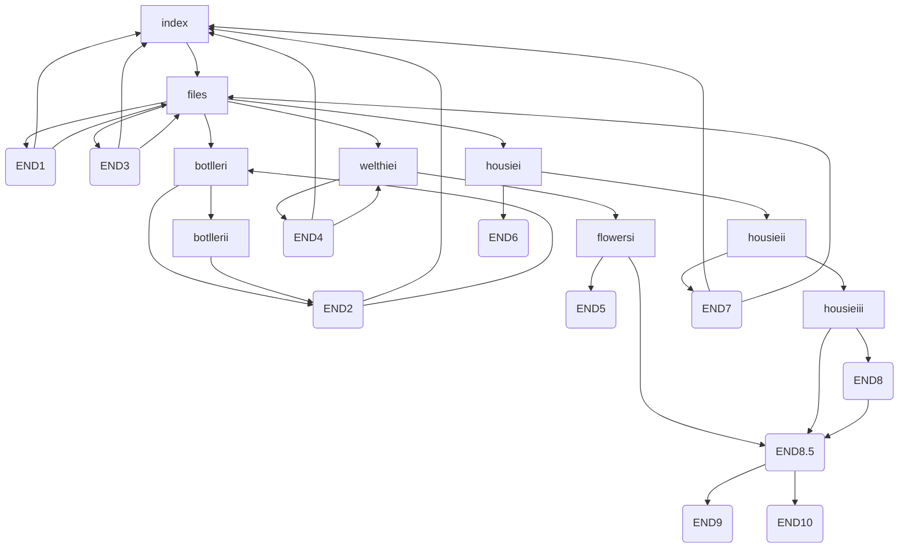

# Detective Flowers
A choice-driven, mystery/psychological thriller text game written in HTML and CSS.

Image here

## Take a look at the rest: 

## Features
- x unique endings 
- x pages
Multiple sections with simple CSS formatting
- Buttons to navigate the story

## How it works

- Entirely made with HTML and CSS, with the written sections being fully original.
- The user uses buttons to navigate the story, automating the process of "flipping a page" in a physical interactive novel. 

- Website layout map: 

## Acknowledgements
- Images taken from free assets on Canva
- W3Schools for help with the navbar (no copy paste)
- Github Documentation, and Mermaid Tutorials for instructions on making a Mermaid diagram
- Inspired by interactive fiction novels, where you flip to a specific page after making a choice

No AI was used to write any part of the story or code. 
