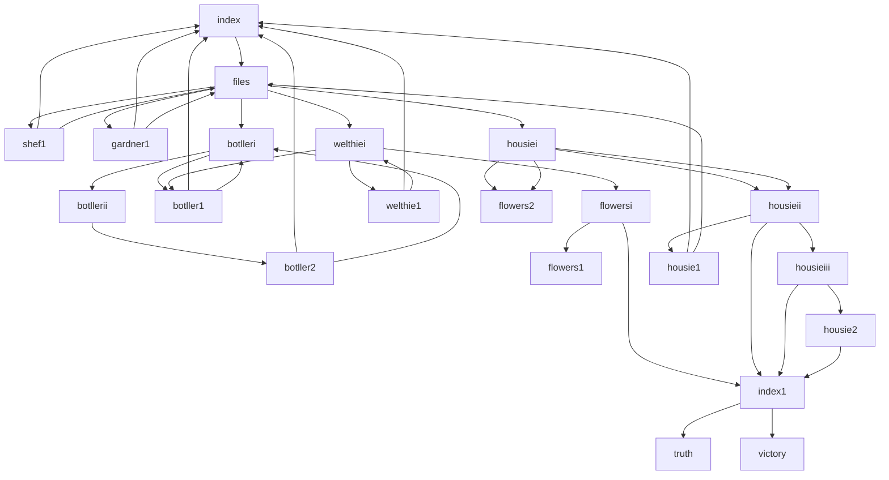

# Detective Flowers
A choice-driven, mystery/psychological thriller text game written in HTML and CSS.

Image here

## Take a look at the rest: 

## Features
- x unique endings 
Multiple sections with simple CSS formatting
- Buttons to choose your own ending

## How it works

- Entirely made with HTML and CSS, with the written sections being fully original

- Website layout map: 

Smith and Noble point out that middle class students are more likely to attend private schools where:
a - they have access to better qualified or experienced teachers coupled with a lower teacher-student ratio. as a result middle class students recieve more attention from their teachers. Classrooms tend to be more engaging which helps explain why they may do better in the education system.
b - furthermore, children in private schools have more facilities such as a diverse range of science labs, and oppurtunities such as a wider range of subjects to choose from. As a result, it is more likely that middle class children in these schools to have the oppurtunity to find something to enjoy and excel in. Middle class children also do well since they can afford extras, such as private tutors to provide specialised support and address individual problems. They can afford extra textbooks which can aid in their preparation. They're able to afford field trips which provide more context (cultural capital). As a result, middle class students are more likely to be able to buy support and assistance that helps them do better in the education system. 
c - working class children are less likely to grow up in an enivronment conducive to studying. 

## Acknowledgements
- Images taken from free assets on Canva
- W3Schools for help with the navbar (no copy paste)
- Github Documentation, and Mermaid Tutorials for instructions on making a Mermaid diagram
- Inspired by interactive fiction novels, where you flip to a specific page after making a choice

No AI was used to write any part of the story or code. 
